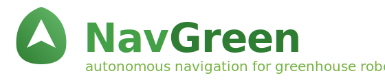

<p align="center">
  
</p>

<p align="center">
  <a href="https://github.com/AndresIslas99/agv-greenhouse/actions/workflows/ci.yaml"></a>
  <a href="LICENSE"></a>
  <a href="#ros-2-distributions"></a>
  <a href="policies/engineering_rules.md"></a>
</p>

**NavGreen** is a production-grade autonomous navigation stack for greenhouse
robots (AGVs). It covers the full stack of a real field robot deployed in a
commercial greenhouse in Mexico: CAN motor control, dual-EKF localization fused
with visual SLAM and AprilTag corrections, Nav2 autonomy, a rail-riding mode
for heating-pipe crop rows, a software safety chain, a browser operator
dashboard, and an optional VDA 5050 fleet layer.

📖 **[Documentation site](https://andresislas99.github.io/agv-greenhouse/)** —
getting started, tutorials, and architecture deep-dives.

**Current MVP**: first field visit with a local-WiFi operator workflow —
teleoperation, map commissioning, waypoint missions, and live monitoring from a
browser tablet.

> NavGreen is the project name; ROS package names keep the `agv_` prefix
> (like Nav2's `nav2_*` packages live under the Nav2 brand).

## Spec-driven development

The most distinctive thing about this repo is not a node — it is the contract
system around the nodes. Machine-readable specs in [`specs/`](specs/) are the
Single Source of Truth (SSOT) for every topic, service, action, operation mode,
launch step, and persistent file. Nine verifiers (5 BLOCKING, 4 WARNING) run in
CI and as a pre-commit hook; if code and spec disagree, the commit is rejected:

```bash
bash tools/verify_specs/all.sh            # run the whole suite locally
bash tools/verify_specs/install_git_hook.sh   # once, to install the pre-commit hook
```

| Spec | Contract |
|------|----------|
| [`specs/interfaces.yaml`](specs/interfaces.yaml) | Every ROS 2 topic / service / action: type, QoS, owner, subscribers |
| [`specs/state_machine.yaml`](specs/state_machine.yaml) | Operation modes and valid transitions |
| [`specs/launch_sequence.yaml`](specs/launch_sequence.yaml) | Startup DAG with timings and preconditions |
| [`specs/persistence.yaml`](specs/persistence.yaml) | Every persistent artifact, its writer and its readers |
| [`specs/hmi_api.yaml`](specs/hmi_api.yaml) | Dashboard ↔ backend HTTP + WebSocket contract |
| [`specs/acceptance.yaml`](specs/acceptance.yaml) | Quality gates per phase |

The workspace is also deliberately **AI-agent-friendly**:
[`AGENT_INSTRUCTIONS.md`](AGENT_INSTRUCTIONS.md) defines a specs-first workflow
for coding agents, and every package carries its own `CLAUDE.md` contract
(responsibilities, owned/consumed interfaces, invariants, failure modes) that
doubles as package documentation for humans.

## Architecture

Command and safety chain (all robot nodes C++17):

```
                Operator tablet (browser)
                       │  WebSocket + REST (:8090)
                       ▼
    web/agv_dashboard ──── agv_ui_backend (TypeScript · rclnodejs)
      (React, ISA-101)          │ nav goals via /navigate_to_pose action
                                │ (teleop cmd_vel and e-stop publish directly)
                                ▼
          Nav2 stack (agv_navigation)
                                │ cmd_vel
                                ▼
          agv_mode_arbiter — 8-state FSM, owns /agv/cmd_vel
          (corridor nav ↔ rail approach/drive ↔ teleop ↔ idle)
                ▲ fed by: agv_zone_detector (corridor vs rail-aisle),
                │ agv_rail_approach, agv_rail_detector, agv_rail_driver
                                │ /agv/cmd_vel
                                ▼
          agv_safety — software cmd_vel gate (operational safeguard,
                                │             NOT certified safety)
                                │ /agv/cmd_vel_safe
                                ▼
          agv_odrive ── CAN bus @ 250 kbps ──► ODrive S1 ──► wheels
```

Localization (dual EKF, wheel odometry fused continuously):

```
    ZED 2i stereo ──► cuVSLAM (external `agv_slam` overlay) ─► visual odom ─┐
    ZED 2i IMU ─────────────────────────────────────────────────────────────┤
    agv_odrive wheel odometry (50 Hz) ──────────────────────────────────────┤
    agv_markers — AprilTag tag36h11 pose corrections ───────────────────────┤
                                                                            ▼
          agv_sensor_fusion — dual EKF
            ekf_local  owns  odom → base_link
            ekf_global owns  map  → odom
          agv_factor_graph — GTSAM iSAM2 sliding window (validation-parallel
                             to ekf_global)
          agv_scan_mapper — live 2D occupancy grid
```

`docs/architecture.md` has detailed diagrams of the localization and
navigation core (it predates the rail/arbiter stack shown above).

## Packages

25 first-party packages in `src/`, plus the fleet layer and the web dashboard.

**Drivetrain & safety chain**

| Package | Purpose | Notes |
|---------|---------|-------|
| `agv_interfaces` | Custom ROS 2 messages (4) and services (8): missions, waypoints, safety status, rail ops | |
| `agv_odrive` | ODrive S1 CAN driver, 50 Hz wheel odometry | Production motor node; also ships Python commissioning/diagnostic tools |
| `agv_hw_interface` | `ros2_control` SystemInterface plugin for the same drivetrain | Opt-in alternative to `agv_odrive`; includes a mock-hardware launch |
| `agv_safety` | Software safety supervisor + `cmd_vel` gate | Last software element before the motor driver |
| `agv_description` | URDF/Xacro robot model, TF tree, sensor mounts | |
| `agv_bringup` | Launch orchestration | Owns the three entry-point launch files |

**Localization & perception**

| Package | Purpose | Notes |
|---------|---------|-------|
| `agv_sensor_fusion` | Dual EKF: local (`odom→base_link`) + global (`map→odom`) | |
| `agv_factor_graph` | GTSAM iSAM2 sliding-window estimator, validation-parallel to the global EKF | Needs GTSAM — not built in CI |
| `agv_localization_init` | Localization auto-initialization orchestration | Needs `zed_msgs` (ZED ROS 2 wrapper) — not built in CI |
| `agv_scan_mapper` | Live 2D occupancy grid from LaserScan | |
| `agv_markers` | AprilTag (tag36h11) pose correction | |
| `agv_zone_detector` | Corridor vs rail-aisle zone detection | |

**Navigation & missions**

| Package | Purpose | Notes |
|---------|---------|-------|
| `agv_navigation` | Nav2 configuration: planning, control, collision monitor | |
| `agv_mode_arbiter` | 8-state FSM owning `/agv/cmd_vel` arbitration | |
| `agv_behaviors` | BehaviorTree.CPP mission execution | |
| `agv_waypoint_manager` | Mission CRUD + sequential waypoint dispatch | |
| `agv_map_manager` | Map persistence, keepout/speed zones | Needs Isaac ROS interfaces — not built in CI |

**Rail operation** (Phase 2: driving on greenhouse heating-pipe rails)

| Package | Purpose | Notes |
|---------|---------|-------|
| `agv_rail_approach` | Precision AprilTag approach to rail-start points | |
| `agv_rail_detector` | Rail tube detection from ZED depth | Builds without the ZED SDK; needs the camera at runtime |
| `agv_rail_driver` | Longitudinal drive along the rails | |

**Operator interface**

| Package | Purpose | Notes |
|---------|---------|-------|
| `agv_image_server` | MJPEG HTTP camera/depth streaming (`:8091`) | |
| `agv_ui_backend` | WebSocket + REST bridge for the dashboard (`:8090`) | TypeScript / rclnodejs |
| `web/agv_dashboard` | React operator dashboard, ISA-101 HMI style | TypeScript / Vite |

**Development & testing**

| Package | Purpose | Notes |
|---------|---------|-------|
| `agv_hil_bridges` | Hardware-in-the-loop (HIL) simulation bridges | `dev_only` |
| `agv_sim` | Gazebo Classic simulation — drive the AGV with no hardware | `dev_only`; built + URDF-validated in CI |
| `agv_integration_tests` | System-level integration tests | |

**Fleet layer** (optional — not part of the default robot runtime; see [`fleet/README.md`](fleet/README.md))

| Package | Purpose | Notes |
|---------|---------|-------|
| `fleet/agv_fleet_manager` | VDA 5050 master: fleet state, order dispatch, REST/WS (`:8092`) | TypeScript |
| `fleet/agv_vda5050_adapter` | Per-robot bridge: ROS 2 graph ↔ VDA 5050 MQTT | TypeScript |
| `fleet/mosquitto`, `fleet/systemd` | MQTT broker config, service units | |

## Build

### What builds from a fresh clone

Everything except three packages whose compile-time dependencies are vendor
SDKs not on public apt (see below). This is exactly what CI does — green badge
above:

```bash
source /opt/ros/humble/setup.bash

# Resolve public dependencies (Nav2, robot_localization, BehaviorTree.CPP,
# apriltag_msgs, ros2_control, cv_bridge, ...)
sudo rosdep init 2>/dev/null; rosdep update
rosdep install --from-paths src --ignore-src -y \
  --skip-keys="isaac_ros_visual_slam isaac_ros_visual_slam_interfaces isaac_ros_nvblox isaac_ros_apriltag_interfaces zed_msgs gtsam OpenCV"

# Build (warnings are errors in every AGV C++ package)
colcon build --symlink-install \
  --packages-skip agv_map_manager agv_localization_init agv_factor_graph \
  --cmake-args -DCMAKE_BUILD_TYPE=Release -DCMAKE_CXX_FLAGS="-Werror"

# Tests
colcon test --packages-skip agv_map_manager agv_localization_init agv_factor_graph
colcon test-result --verbose
```

TypeScript packages (rclnodejs generates ROS bindings at `npm ci` time, so
source the ROS environment first):

```bash
cd src/agv_ui_backend  && npm ci && npm run build   # operator backend
cd web/agv_dashboard   && npm ci && npm run build   # dashboard
```

### Vendor SDK dependencies

Three packages need vendor stacks that are not on public apt and are therefore
skipped in CI (CI builds 20 packages with `-Werror` in the `build-and-test`
job, and `agv_sim` in a dedicated headless-Gazebo job):

| Package | Compile-time dependency | Source |
|---------|------------------------|--------|
| `agv_map_manager` | `isaac_ros_visual_slam_interfaces` | [NVIDIA Isaac ROS](https://nvidia-isaac-ros.github.io/) |
| `agv_localization_init` | `zed_msgs` | [ZED ROS 2 wrapper](https://github.com/stereolabs/zed-ros2-wrapper) (ZED SDK) |
| `agv_factor_graph` | GTSAM | [borglab/gtsam](https://github.com/borglab/gtsam) |

`agv_bringup` is also skipped in CI because it declares all three packages
above as runtime dependencies; with a full vendor install it builds normally.

The `.gitignore` also lists third-party ROS packages (Isaac ROS, ZED wrapper,
etc.) that are cloned separately into `src/` on the Jetson.

### Running without the robot

- **Fastest start**: open the repo in the provided dev container
  ([`.devcontainer/`](.devcontainer/), VS Code "Reopen in Container" or any
  devcontainer-compatible tool). It matches CI (ROS 2 Humble + colcon +
  Node 20) and resolves workspace dependencies on first launch, so
  `colcon build` and the TypeScript builds work with no host setup.
- **Drive the robot in simulation (no hardware)** — the `agv_sim` package runs
  the AGV in Gazebo Classic with physics:
  ```bash
  ros2 launch agv_sim teleop_sim.launch.py   # GUI + keyboard teleop
  ros2 launch agv_sim sim.launch.py gui:=true rviz:=true
  ros2 launch agv_sim sim.launch.py          # headless
  ```
  It reuses the real robot geometry and the production `diff_drive_controller`
  gains; drive it by publishing `geometry_msgs/Twist` on `/cmd_vel` and watch
  `/odom`. It is drivetrain-only (no cameras or lidar yet — see the roadmap
  issues for adding sensors + Nav2 in sim). CI builds the package and validates
  the URDF; the identical controller stack is smoke-tested headless via
  `ros2_control` mock components, and the Gazebo world-load + robot-spawn run
  as a best-effort check (a full physics drive works locally with a display —
  see the tracking issue on headless `gazebo_ros2_control`).
- **Mock drivetrain (even lighter)**: `ros2 launch agv_hw_interface
  agv_ros2control_mock.launch.py` runs the `ros2_control` stack with mock
  components — no Gazebo, drive it with `ros2 topic pub`, watch `/joint_states`.
- **You currently cannot**: run the *full autonomy* stack in simulation. The
  production robot launch files require the external `agv_slam` overlay
  (cuVSLAM pipeline), which is not published, and the Isaac-Sim HIL loop needs
  the maintainer's unpublished sim workspace plus a physical Jetson (see
  [`docs/validation/RUNBOOK_lan_hil.md`](docs/validation/RUNBOOK_lan_hil.md)).
  `agv_sim` is the hardware-free way to work on the drivetrain and, as it
  grows sensors, navigation.

### ROS 2 distributions

CI builds and tests on **ROS 2 Humble** (`ros:humble` container). The
greenhouse Jetson runs **ROS 2 Jazzy**; the HIL simulation host runs Humble.
Only standard message types cross that cross-distro DDS boundary — the
rationale is documented in [`specs/launch_sequence.yaml`](specs/launch_sequence.yaml)
and [`specs/interfaces.yaml`](specs/interfaces.yaml).

## Launch modes

These are the only launch entry points in `src/agv_bringup/launch/` (earlier
`agv_robot_core` / `agv_teleop` launch files were removed in the 2026-04-13
audit):

| Mode | Command | Notes |
|------|---------|-------|
| Full robot stack | `ros2 launch agv_bringup agv_full.launch.py map:=<map.yaml>` | Production autonomy on the Jetson. `map` may be empty (load one later from the dashboard). Requires the external `agv_slam` overlay. |
| Full stack, HIL sensors | `ros2 launch agv_bringup agv_full.launch.py hil_mode:=true map:=<map.yaml>` | Same brain stack; skips hardware-bound nodes (ZED+cuVSLAM, ODrive CAN, image server) in favor of simulated sensor inputs. |
| Mapping commissioning | `ros2 launch agv_bringup agv_mapping.launch.py` | Teleop mapping run (0.3–0.5 m/s protocol, see [`docs/mapping_commissioning.md`](docs/mapping_commissioning.md)). Requires `agv_slam`. |
| LAN HIL validation | `ros2 launch agv_bringup agv_hil_full.launch.py map:=<map.yaml>` | Brain stack against a simulator on the LAN (`map` required). Sim infrastructure is not included in this repo. |
| Gazebo simulation (no hardware) | `ros2 launch agv_sim teleop_sim.launch.py` | Drive the AGV in Gazebo Classic with physics — the hardware-free entry point. Headless variant (`sim.launch.py`) runs in CI. |
| Mock drivetrain (no hardware) | `ros2 launch agv_hw_interface agv_ros2control_mock.launch.py` | `ros2_control` with mock components — navigation/behaviors development without the robot. |

## Hardware

- **Compute**: Jetson AGX Orin 64GB (development) / Jetson Orin NX 16GB (production)
- **Drivetrain**: 2× M8325s BLDC motors via [ODrive S1](https://odriverobotics.com/) controllers, CAN bus @ 250 kbps
- **Camera**: [ZED 2i](https://www.stereolabs.com/zed-2i) stereo (RGB + depth + IMU)
- **Kinematics**: differential drive — nominal geometry in
  [`src/agv_description/config/robot_params.yaml`](src/agv_description/config/robot_params.yaml),
  field-calibrated values in [`src/agv_odrive/config/odrive_params.yaml`](src/agv_odrive/config/odrive_params.yaml)
- **Markers**: AprilTag family [tag36h11](https://github.com/AprilRobotics/apriltag) as pose anchors and drift correctors

Getting `can0` up on a Jetson is **not** trivial —
[`docs/hardware_setup.md`](docs/hardware_setup.md) documents the pinmux, CAN,
and ODrive configuration end to end.

## Security & safety

Read [SECURITY.md](SECURITY.md) before deploying. Short version: the stack is
designed for an **isolated greenhouse LAN**; dashboard authentication is
**disabled by default** (no default accounts ship — create users and enable it
before any field deployment), and the MQTT fleet broker defaults to anonymous
access.

The software safeguards in this repository (collision monitor, mode
arbitration, software E-stop paths) are **not certified functional safety**.
Certified human safety requires external hardware-integrated scope.

## Documentation

- [`docs/architecture.md`](docs/architecture.md) — localization & navigation core diagrams
- [`docs/hardware_setup.md`](docs/hardware_setup.md) — Jetson CAN pinmux, ODrive setup
- [`docs/operator_runbook.md`](docs/operator_runbook.md) — field operation procedures
- [`docs/mapping_commissioning.md`](docs/mapping_commissioning.md) — map creation protocol
- [`docs/dual_ekf_validation.md`](docs/dual_ekf_validation.md) — localization validation
- [`docs/low_speed_validation.md`](docs/low_speed_validation.md) — drivetrain commissioning checklist
- [`docs/architectural_gaps.md`](docs/architectural_gaps.md) — known architecture debt, honestly documented
- [`docs/production_readiness_assessment.md`](docs/production_readiness_assessment.md) — production readiness review
- [`docs/audit/2026-04-13-full-audit.md`](docs/audit/2026-04-13-full-audit.md) — the audit that produced the spec system
- [`docs/reviews/2026-07-06-community-readiness-review.md`](docs/reviews/2026-07-06-community-readiness-review.md) — full findings ledger from the pre-release review
- [`specs/README.md`](specs/README.md) — how to read the specs, in order

## Contributing

Contributions are welcome — see [CONTRIBUTING.md](CONTRIBUTING.md) (specs-first
workflow, C++17 ground rules, maintainership) and the
[Code of Conduct](CODE_OF_CONDUCT.md). AI coding agents should start at
[AGENT_INSTRUCTIONS.md](AGENT_INSTRUCTIONS.md). Changes worth noting go in
[CHANGELOG.md](CHANGELOG.md).

Before committing:

```bash
bash tools/verify_specs/all.sh
```

## Glossary

| Term | Meaning |
|------|---------|
| HIL | Hardware-in-the-loop: real brain stack driven by simulated sensor inputs |
| cuVSLAM | GPU visual SLAM from [NVIDIA Isaac ROS Visual SLAM](https://github.com/NVIDIA-ISAAC-ROS/isaac_ros_visual_slam) |
| VDA 5050 | Standardized AGV ↔ fleet-master MQTT protocol ([spec](https://github.com/VDA5050/VDA5050)) |
| ISA-101 | ISA human-machine-interface design standard used by the dashboard |
| SSOT | Single Source of Truth — here, the machine-readable `specs/*.yaml` |
| tag36h11 | The [AprilTag](https://april.eecs.umich.edu/software/apriltag) family used for pose anchors |

## License

[MIT](LICENSE) © 2026 Andres Islas
