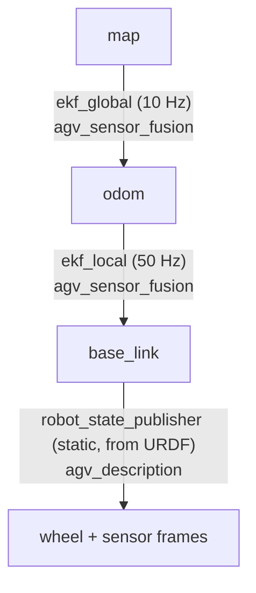

# Localization (dual EKF)

NavGreen localizes with two chained Extended Kalman Filters from
`robot_localization`, configured in
[`agv_sensor_fusion`](https://github.com/AndresIslas99/NavGreen/blob/main/src/agv_sensor_fusion/CLAUDE.md):
a fast **local** filter that keeps odometry smooth and continuous, and a
slower **global** filter that absorbs visual SLAM and absolute corrections.
The split exists because a greenhouse is a hostile place for vision:
crop rows are visually repetitive, lighting changes across the day, and wet
or reflective surfaces disturb visual features. Wheel odometry is therefore
fused **continuously**, and AprilTags act as **drift correctors and pose
anchors — never the sole localization strategy**. Both rules are canonical in
[`specs/project.yaml`](https://github.com/AndresIslas99/NavGreen/blob/main/specs/project.yaml).

## The two filters

| | `ekf_local` | `ekf_global` |
|---|---|---|
| Rate | 50 Hz | 10 Hz |
| Owns TF | `odom -> base_link` (sole owner) | `map -> odom` (sole owner) |
| Output topic | `/agv/odometry/local` | `/agv/odometry/global` |
| Inputs | `/agv/wheel_odom_validated` (absolute), `/agv/imu/filtered` | `/agv/odometry/local` (differential), cuVSLAM `/visual_slam/tracking/odometry` (differential), `/agv/marker_pose` (absolute AprilTag), `/agv/zed/pose_with_covariance` (absolute ZED Area Memory) |
| Character | Continuous, never jumps | Allowed to jump on corrections |
| Serves `set_pose` | No (remapped away) | Yes — `/agv/set_pose`, sole server |

Both filters run in `two_d_mode`. The global filter consumes the local
estimate and cuVSLAM **differentially** to avoid double-counting drift, and
rejects outliers by Mahalanobis distance: cuVSLAM pose 3.5 / twist 2.5,
AprilTag pose 3.0, ZED Area Memory pose 3.0 (tightened to match the AprilTag
gate so the stricter absolute source wins on disagreement). Configuration:
[`ekf_local.yaml`](https://github.com/AndresIslas99/NavGreen/blob/main/src/agv_sensor_fusion/config/ekf_local.yaml)
and
[`ekf_global.yaml`](https://github.com/AndresIslas99/NavGreen/blob/main/src/agv_sensor_fusion/config/ekf_global.yaml).

## TF tree ownership

Exactly one node publishes each transform. This is an enforced invariant, not
a convention — two publishers on `map -> odom` produce TF jitter, localization
divergence, and navigation failures.



How the single-owner invariants are enforced (from
[`specs/state_machine.yaml`](https://github.com/AndresIslas99/NavGreen/blob/main/specs/state_machine.yaml)
and
[`specs/interfaces.yaml`](https://github.com/AndresIslas99/NavGreen/blob/main/specs/interfaces.yaml)):

- **cuVSLAM TF is disabled** via the `/**:` override in
  [`cuvslam_greenhouse.yaml`](https://github.com/AndresIslas99/NavGreen/blob/main/src/agv_bringup/config/cuvslam_greenhouse.yaml)
  — it contributes odometry as a topic only.
- **The ZED wrapper** runs with `publish_tf=false`.
- **SLAM Toolbox** runs with `transform_publish_period=0.0` (TF disabled).
- **`agv_factor_graph`** must keep `publish_tf=false` (see below).

!!! note "Mapping mode is the exception"
    In the dedicated commissioning launch (`AGV_MODE=mapping`,
    `agv_mapping.launch.py`) cuVSLAM owns both transforms and the dual EKF is
    not running. That is a different launch file with a different TF
    invariant — see
    [`specs/state_machine.yaml`](https://github.com/AndresIslas99/NavGreen/blob/main/specs/state_machine.yaml)
    layer 1 and [Mapping commissioning](../mapping_commissioning.md).

## The IMU pipeline

Greenhouse floors transmit mechanical vibration into the gyro. The raw ZED 2i
IMU (200 Hz) passes through `imu_filter_node`, a second-order Butterworth
low-pass — 10 Hz cutoff on angular velocity, 5 Hz on acceleration,
orientation passed through unfiltered — before any EKF sees it:

```
/agv/zed/imu/data (200 Hz, raw)
  -> imu_filter_node (Butterworth 2nd order)
  -> /agv/imu/filtered
  -> ekf_local
```

The filter must start before the EKFs (t=3.5 s vs t=4.0 s in the
[startup DAG](https://github.com/AndresIslas99/NavGreen/blob/main/specs/launch_sequence.yaml))
so the filter has a history buffer when fusion begins. The local EKF trusts
IMU yaw over wheel encoders: IMU yaw covariance (0.02 rad²) is tighter than
the wheel-odometry yaw base (0.03), and encoder covariance inflates with
rotation rate, so the gyro dominates heading during turns.

## Wheel-slip covariance inflation

`ekf_local` does **not** consume `/agv/wheel_odom` directly. The
`wheel_slip_detector` node sits in between and republishes it as
`/agv/wheel_odom_validated`, 1:1 at 50 Hz — with one change: when the
residual between IMU yaw rate and wheel-derived yaw rate exceeds a threshold
(the signature of passive-caster slip), it sets the twist covariance for
`vx` and `wz` to a sentinel value of `1e6`. `robot_localization` treats
covariance ≥ `1e3` as effectively ignored for that update, so slipping wheel
data stops pulling the filter without ever interrupting the stream.

This sentinel approach follows the `robot_localization` documentation's
guidance ("don't multiply covariance — make the filter ignore the update"),
superseding the ODrive node's own `caster_covariance_multiplier` inflation:
that multiplier still shapes the raw `/agv/wheel_odom` covariance, but the
slip detector rewrites the `vx`/`wz` twist covariances on the validated
topic before the EKF sees them. A
companion node, `caster_dwell_advisor`, publishes an advisory JSON stream
(`/agv/caster/dwell_state`) recommending a pause after direction reversals so
the casters can realign — no runtime node consumes it yet; closing that loop
is documented post-MVP work in
[`specs/interfaces.yaml`](https://github.com/AndresIslas99/NavGreen/blob/main/specs/interfaces.yaml).

## AprilTag corrections (tag36h11)

[`agv_markers`](https://github.com/AndresIslas99/NavGreen/blob/main/src/agv_markers/CLAUDE.md)
turns AprilTag detections into global pose corrections:

- **Pose estimation**: `cv::solvePnP` from the four tag corners plus camera
  intrinsics; tag poses in the map frame come from a marker registry file
  (hot-reloadable via `/agv/markers/registry_reload` after the dashboard
  edits it).
- **Covariance scales with range**: `cov = base * (1 + (range/2)^2)`, so a
  far tag nudges the filter while a near tag corrects it firmly. Detections
  beyond `max_detection_range` (default 5 m) are ignored.
- **Normal operation** publishes `/agv/marker_pose`
  (`PoseWithCovarianceStamped`), which `ekf_global` fuses as an absolute pose
  source with a 3.0 rejection threshold — the EKF still gets to reject
  outlier detections.
- **Relocalization (RELOC)**: if the distance between the tag-derived pose
  and the EKF pose exceeds `relocalization_threshold` (default 2.0 m), the
  filter is beyond gentle correction. `marker_correction` then calls the
  `set_pose` service for a hard EKF reset, followed by a cooldown (default
  500 ms) so the reset and regular corrections cannot race.
- **Suppression near rails**: corrections are suppressed inside rail aisles
  and while a rail drive is active (`marker_correction` subscribes
  `/agv/zone/state` and `/agv/rail_driver/state`), so a tag glimpsed between
  crop rows cannot yank the pose while the robot is constrained on rails.

### `set_pose` belongs to the global filter only

A map-frame pose reset must never land on `ekf_local`, whose
`odom -> base_link` output has to stay continuous. `fusion.launch.py` remaps
the local filter's `set_pose` to `/agv/ekf_local/set_pose`, so the shared
name `/agv/set_pose` is served by **`ekf_global` alone**. Both callers —
`marker_correction` (RELOC) and the relocalization orchestrator (pose
seeding) — use the relative name `set_pose`, which resolves to the global
filter deterministically.

## Relocalization on map load

When a map is loaded, the `auto_init_orchestrator`
([`agv_localization_init`](https://github.com/AndresIslas99/NavGreen/blob/main/src/agv_localization_init/CLAUDE.md))
runs a fallback cascade and reports progress as JSON on
`/agv/localization/state` (`INITIALIZING | LOCALIZED | DEGRADED | FAILED`):

| Path | Mechanism | Needs |
|---|---|---|
| A0 | ZED Area Memory relocalization (`<map>.area` landmark DB) | ZED wrapper (patched fork) |
| A | cuVSLAM `localize_in_map` against the per-map keyframe DB (`<map>_cuvslam/`) | cuVSLAM + saved DB |
| B | Absolute AprilTag pose | A visible registered tag |
| C | Last-known pose from `<map>_meta.json` | The sidecar file on disk |

The winning path seeds `ekf_global` through `/agv/set_pose`. If everything
fails, the state is `FAILED`, the dashboard LOC pill goes red, and nav-goal
dispatch is gated off (a stale `map -> odom` would send the robot to phantom
coordinates — an incident documented in
[`specs/state_machine.yaml`](https://github.com/AndresIslas99/NavGreen/blob/main/specs/state_machine.yaml),
invariant `nav_goal_requires_localization`). Recovery: teleop toward a
visible tag and call `/agv/localization/reinitialize`.

!!! warning "Vendor SDK required"
    `agv_localization_init` compiles against `zed_msgs` (ZED ROS 2 wrapper)
    and the cascade calls Isaac ROS cuVSLAM services, so this package is not
    built in CI and the cascade cannot run without the vendor stacks on a
    Jetson. The same applies to the cuVSLAM input of `ekf_global` — in its
    absence the global filter degrades to wheel + IMU + marker inputs.

## The validation-parallel factor graph

[`agv_factor_graph`](https://github.com/AndresIslas99/NavGreen/blob/main/src/agv_factor_graph/CLAUDE.md)
runs a GTSAM iSAM2 sliding-window estimator over fused odometry, cuVSLAM
visual odometry, and AprilTag marker poses, and publishes a
validation-parallel pose on `/agv/factor_graph/odometry` (~10 Hz, driven by
its odometry input). It is a **silent observer**:
`publish_tf=false` is an invariant (a second `map -> odom` publisher would
corrupt the estimate it is meant to validate), nothing downstream consumes
its output, and a crash has zero navigation impact. Its purpose is to gather
evidence for a possible future cutover from EKF to factor-graph estimation
by comparing it against `/agv/odometry/global`. One honest caveat: today its
odometry input **is** `/agv/odometry/global` itself, so it is not yet an
independent check — making it consume the raw sources instead is tracked in
[#10](https://github.com/AndresIslas99/NavGreen/issues/10). It needs
GTSAM, so it is not built in CI.

## Validating the stack

The dual-EKF bench and field validation procedure — expected rates, TF
checks, drift measurements — is documented in
[Dual EKF validation](../dual_ekf_validation.md). The acceptance criteria
(TF tree complete within 5 s, `/agv/wheel_odom` near 50 Hz, single-owner
responsibilities respected) live in
[`specs/acceptance.yaml`](https://github.com/AndresIslas99/NavGreen/blob/main/specs/acceptance.yaml).
