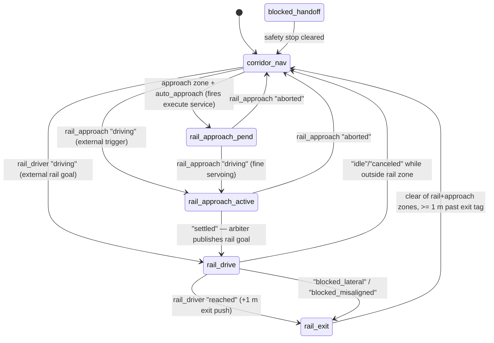

# Navigation & mode arbitration

Corridors and rail aisles are two different worlds. In corridors, Nav2 plans
and drives. Inside a rail aisle — two 51 mm heating-pipe tubes flanked by
crop rows — any rotation risks clipping a tube, so a dedicated
longitudinal-only controller takes over and Nav2 is locked out. The component
that decides who drives at every instant is `agv_mode_arbiter`, an 8-state
FSM that owns `/agv/cmd_vel`.

This page covers the Nav2 configuration, the zone detector, the arbiter FSM,
and the rail approach/drive/exit flow. Ground truth:
[`specs/state_machine.yaml`](https://github.com/AndresIslas99/NavGreen/blob/main/specs/state_machine.yaml)
(`layer_5_runtime_arbiter`) and
[`mode_fsm.hpp`](https://github.com/AndresIslas99/NavGreen/blob/main/src/agv_mode_arbiter/include/agv_mode_arbiter/mode_fsm.hpp)
— a verifier fails the build if the two ever drift.

## Nav2 configuration

[`agv_navigation`](https://github.com/AndresIslas99/NavGreen/blob/main/src/agv_navigation/CLAUDE.md)
contains no custom C++ — it is configuration, launch, and one custom behavior
tree over standard Nav2 nodes:

| Component | Choice | Notes |
|---|---|---|
| Planner | `SmacPlanner2D` | Max planning time 2.0 s |
| Controller | `RotationShimController` wrapping `MPPIController` | 20 Hz |
| Behavior tree | Custom `navigate_to_pose_forward_only.xml` | `BackUp` recovery removed |
| Costmap layers | `static_layer` + `voxel_layer` (from `/agv/scan`) + `inflation_layer` | Local costmap is a 3 m rolling window |
| Goal tolerance | xy 0.15 m, yaw 0.25 rad (production) | HIL overrides: 0.10 m xy (tighter), 0.30 rad yaw (looser) |
| Goal dispatch | `/agv/navigate_to_pose` action | The canonical interface — no topic-based goals |

Two velocity limits are safety decisions, not tuning:

- **`vx_min: 0.0` — forward-only.** The only exteroceptive sensor is a
  front-facing ZED 2i; there is no rear perception, so reverse in corridors
  is structurally unsafe. It is forbidden three ways: MPPI samples no
  negative `vx`, a `PreferForwardCritic` weight of 18.0 dominates path
  alignment, and the custom BT removes the `BackUp` recovery. (Inside a rail,
  reverse **is** allowed — `agv_rail_driver` can back out, because the rail
  constrains the geometry.)
- **`vx_max: 0.25 m/s`.** Capped so the collision monitor's 20 cm stop-zone
  margin always exceeds the physical stopping distance — see the
  [safety model](safety.md#the-collision-monitor).

Nav goals from the dashboard pass through backend gates before Nav2 ever
sees them: mode must be `nav`, motors armed, localization not `FAILED`,
collision-monitor state fresh, no mission in progress. The full gate list per
caller is in
[`specs/interfaces.yaml`](https://github.com/AndresIslas99/NavGreen/blob/main/specs/interfaces.yaml)
under `actions`.

## Zone detection: corridor vs rail aisle

[`agv_zone_detector`](https://github.com/AndresIslas99/NavGreen/blob/main/src/agv_zone_detector/CLAUDE.md)
classifies the robot's global pose (`/agv/odometry/global`) against the known
greenhouse geometry and publishes `/agv/zone/state` at 10 Hz — JSON with the
zone label, the matched aisle's center line, the robot's lateral offset and
yaw error relative to the rail axis, a confidence value, and the AprilTag ID
of the nearest approach point. Labels:

- `corridor_west`, `corridor_east` — open corridor, Nav2 territory
- `gap` — the rail-free strip between rail sections
- `rail_approach_front`, `rail_approach_rear` — approach strips at aisle
  entrances (sub-zones of the gap, outside the tubes)
- `rail_aisle_0`, `rail_aisle_p22`, `rail_aisle_m22`, `rail_aisle_p44`,
  `rail_aisle_m44` — the five rail aisles per section
- `unknown` — an error state that should not occur in operation

The classifier is purely geometric (no sensors, no history) and lives in a
ROS-free header so it is unit-tested without spinning a node. It does **no**
control: the arbiter and the rail driver decide what to do with the zone.

## The mode arbiter

`agv_mode_arbiter` is the **sole regular publisher of `/agv/cmd_vel`** in
production. Upstream controllers each publish to their own topic and the
arbiter relays exactly one of them per FSM state — it does no control math,
it only selects:

| FSM state | Relays | Meaning |
|---|---|---|
| `corridor_nav` | `/agv/cmd_vel_nav` | Normal Nav2 corridor navigation |
| `rail_approach_pend` | `/agv/cmd_vel_nav` | Rail approach requested; Nav2 keeps authority during coarse approach / tag acquisition |
| `rail_approach_active` | `/agv/cmd_vel_approach` | AprilTag fine-servoing onto the rail head |
| `rail_drive` | `/agv/cmd_vel_rail` | Longitudinal-only drive on the rails (`wz` hard-zeroed) |
| `rail_exit` | `/agv/cmd_vel_rail` | Controlled push off the rail back to the corridor |
| `blocked_handoff` | nothing (zero cmd_vel) | Collision-monitor STOP or unresolvable state — holds until clear |
| `teleop` | nothing (arbiter silent) | Operator override; `teleop_server` publishes `/agv/cmd_vel` directly |
| `idle` | nothing (zero cmd_vel) | Operator override |

The FSM itself is a pure, header-only, ROS-free function
(`mode_fsm.hpp::step`) with 32 unit tests. State is broadcast at 20 Hz as
JSON on `/agv/mode/state`.

Two preemptive branches run **before** the diagram above on every tick, from
any state:

1. **Operator override** — `/agv/mode/set` = `idle` forces `idle`;
   `teleop` forces `teleop` (with one carve-out: if `rail_approach` is
   actively acquiring or servoing on a tag, the arbiter still relays
   `/agv/cmd_vel_approach`, so the dashboard's "align to this tag" workflow
   works without leaving teleop).
2. **Safety stop** — a collision-monitor STOP (or the HIL string
   side-channel saying `stop`; the two are OR-ed) forces `blocked_handoff`
   with zero cmd_vel until the signal clears, then falls back to
   `corridor_nav` and lets the zone logic re-enter the rail flow if needed.

### Operator modes: two vocabularies, two layers

The dashboard's runtime mode (layer 3: `teleop | mapping | nav` on
`/agv/mode`) gates **what the operator can do**; the arbiter's operator
directive (layer 5: `nav | teleop | idle` on `/agv/mode/set`) gates **whose
twist reaches the motors**. The backend translates between them — layer-3
`mapping` is published to the arbiter as `teleop`, since the arbiter has no
mapping concept. In `nav`, the arbiter runs its autonomous zone-driven
selection; in `teleop`/`idle`, it stands down. See
[`specs/state_machine.yaml`](https://github.com/AndresIslas99/NavGreen/blob/main/specs/state_machine.yaml)
for the full five-layer mode matrix.

## The rail flow

End to end, a rail traversal looks like this:

1. **Approach request.** Entering an approach strip does nothing by default:
   `auto_approach` is `false` in
   [`mode_arbiter_params.yaml`](https://github.com/AndresIslas99/NavGreen/blob/main/src/agv_mode_arbiter/config/mode_arbiter_params.yaml)
   — the arbiter is an observer/router, and the caller (dashboard, mission
   executor, or test harness) fires `/agv/rail_approach/execute` explicitly.
   Profiles that want hands-off docking set `auto_approach: true`, which
   makes the arbiter fire the service itself on entering an approach strip
   (`rail_approach_pend`).
2. **Coarse approach and tag acquisition.**
   [`agv_rail_approach`](https://github.com/AndresIslas99/NavGreen/blob/main/src/agv_rail_approach/CLAUDE.md)
   first asks Nav2 to drive to a standoff pose before the tag (skippable via
   the service's `skip_coarse_approach` flag when the robot is already in
   front of the tag), then waits for the camera to detect the target
   AprilTag. Nav2 keeps cmd_vel authority throughout — the arbiter stays on
   `cmd_vel_nav`.
3. **Fine servoing** (`rail_approach_active`). A PI+feed-forward controller
   servos the robot onto the rail head using the live tag detection; the
   arbiter relays `/agv/cmd_vel_approach`.
4. **Rail drive** (`rail_drive`). On `settled`, the arbiter publishes a goal
   on `/agv/rail_driver/goal` and switches to `/agv/cmd_vel_rail`.
   [`agv_rail_driver`](https://github.com/AndresIslas99/NavGreen/blob/main/src/agv_rail_driver/CLAUDE.md)
   is a P-controlled, longitudinal-only driver: **`angular.z == 0` in every
   message it publishes**, guaranteed structurally in its ROS-free
   controller header. It aborts to `blocked_misaligned` if yaw error vs the
   rail axis exceeds ~15° and to `blocked_lateral` if the robot drifts more
   than 0.30 m off the goal line. Optionally,
   [`agv_rail_detector`](https://github.com/AndresIslas99/NavGreen/blob/main/src/agv_rail_detector/CLAUDE.md)
   feeds visual lateral/yaw corrections from ZED depth (BEV + RANSAC on the
   two tubes, ~5 Hz), used only when its confidence exceeds 0.7 and the
   detection is fresh — pose-based checks are the safe default.
5. **Rail exit** (`rail_exit`). When the rail goal is reached, the arbiter
   pushes an **extended goal 1 m past the exit AprilTag** so the robot rolls
   clear of the aisle with `wz` still locked to zero. Only when the zone is
   no longer rail or approach, the clearance past the exit tag is ≥ 1 m,
   **and** the rail driver is no longer driving does the FSM hand back to
   `corridor_nav` — never earlier, because Nav2's MPPI would sample
   rotations next to the tubes and crop rows.

!!! danger "The RAIL_EXIT hard-lock"
    Once inside a rail (`rail_drive` or `rail_exit`), the FSM refuses to
    hand back to Nav2 while the robot is physically inside the rail zone —
    even if the rail driver is canceled or blocked. The escape route inside
    an aisle is reversing out through `/agv/rail_driver/goal` (rail reverse
    is allowed), not rotating. One auxiliary release exists: parked idle in
    an **approach strip** (which sits outside the tubes), the FSM returns to
    `corridor_nav`, since rotation there is not a tube hazard.

## Collision monitor integration

Nav2's collision monitor acts on the velocity stream (it sits between the
smoother and the safety gate — see the
[command chain](overview.md#the-command-and-safety-chain)), but its state
also feeds the mode logic:

- The **arbiter** subscribes to `/agv/collision_monitor_state`
  (`nav2_msgs/CollisionMonitorState`); a STOP action forces
  `blocked_handoff` — zero cmd_vel regardless of which controller was
  active — until the condition clears.
- The **rail driver** holds in `blocked_wait` (zero velocity, indefinitely,
  never rotating, never retrying) while a stop is asserted during a rail
  traversal. In production it relies on the arbiter's `blocked_handoff` for
  this; its own string-typed subscription on that topic name is a HIL/test
  side-channel only.

Polygon sizing, sensor sources, and the gate behind all of this are covered
in the [safety model](safety.md).

!!! note "Running this stack"
    The full navigation + arbiter stack launches on the robot with
    `ros2 launch agv_bringup agv_full.launch.py map:=<map.yaml>` (rail stack
    at t=7 s, gated on a map being loaded) and in hardware-in-the-loop
    against a simulator. It does **not** run in the in-repo `agv_sim`
    Gazebo simulation, which is drivetrain-only today. See
    [Getting started](../getting-started.md) for what runs where.
