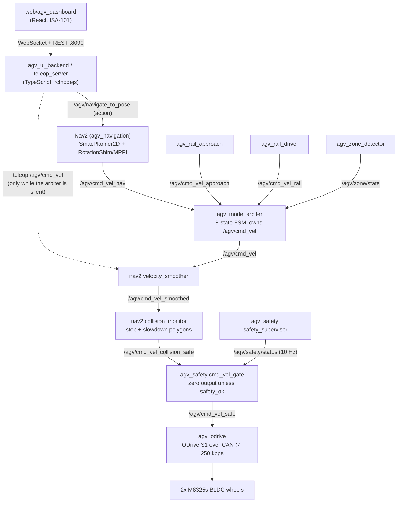
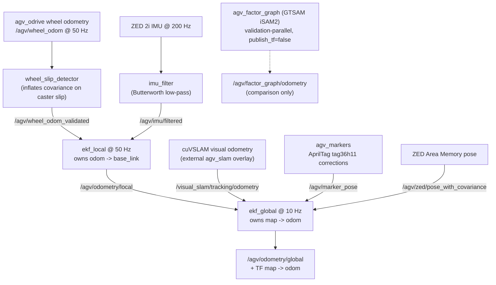

# Architecture overview

NavGreen is a full field-robot stack: everything between a browser tablet on
the greenhouse WiFi and two BLDC motors on a CAN bus. This page shows the
system at a glance — the two chains that matter (command/safety and
sensing/localization), the subsystems, and where the code runs.

Everything below is backed by machine-readable contracts in
[`specs/`](https://github.com/AndresIslas99/NavGreen/blob/main/specs/README.md).
If this page and a spec ever disagree, the spec wins — see
[The spec system](spec-system.md).

## The command and safety chain

Every velocity command follows one path to the motors. No node other than the
mode arbiter regularly publishes `/agv/cmd_vel`, and nothing reaches the
motor driver without passing the collision monitor and the safety gate
(when a map is loaded — the production case).

Key facts about this chain:

- **The dashboard never speaks DDS.** `agv_ui_backend` translates REST and
  WebSocket calls into ROS 2 topics, services, and the `/agv/navigate_to_pose`
  action, and it owns the action gates (motors armed, localization not
  FAILED, collision-monitor freshness) that protect goal dispatch. Teleop
  `cmd_vel` and the e-stop publish directly from the backend.
- **`agv_mode_arbiter` is the sole regular publisher of `/agv/cmd_vel`.** It
  relays exactly one upstream source per FSM state — Nav2, the rail
  approach controller, or the rail driver — and publishes zero when blocked.
  The teleop server writes `/agv/cmd_vel` directly only when the operator
  forces teleop and the arbiter goes silent. Details in
  [Navigation & mode arbitration](navigation-and-modes.md).
- **The safety chain is only active when a map is loaded** (`has_map=true`,
  the normal production condition). In the map-less mapping-first branch the
  ODrive driver consumes `/agv/cmd_vel` directly, with no collision
  protection — see
  [`specs/state_machine.yaml`](https://github.com/AndresIslas99/NavGreen/blob/main/specs/state_machine.yaml)
  layer 2.
- **The gate fails safe.** If the supervisor stops publishing, crashes, or
  reports any monitored topic silent, the gate forces zero velocity. See
  [Safety model](safety.md).

!!! warning "Operational safeguards, not certified safety"
    Everything in this chain is software. It is designed carefully, but it is
    **not certified functional safety** — see the [safety model](safety.md).

## The sensing and localization chain

Localization is a dual EKF (`robot_localization`): a fast local filter for
smooth, continuous odometry, and a slower global filter that absorbs visual
SLAM and absolute corrections.

Wheel odometry is fused continuously — a deliberate greenhouse rule, because
repetitive crop rows, changing light, and wet surfaces can all degrade visual
tracking. AprilTags are drift correctors and pose anchors, never the sole
localization source. The full design, including TF ownership invariants and
the relocalization cascade, is in [Localization (dual EKF)](localization.md).

## Subsystems

| Subsystem | Packages | One line | Deep dive |
|---|---|---|---|
| Localization | `agv_sensor_fusion`, `agv_markers`, `agv_localization_init`, `agv_factor_graph`, `agv_scan_mapper` | Dual EKF fusing wheel + IMU + cuVSLAM + AprilTag corrections; auto-relocalization cascade on map load | [Localization](localization.md) |
| Navigation | `agv_navigation`, `agv_behaviors`, `agv_waypoint_manager`, `agv_map_manager` | Nav2 with SmacPlanner2D + MPPI, forward-only behavior tree, map persistence | [Navigation & modes](navigation-and-modes.md) |
| Rail system | `agv_zone_detector`, `agv_mode_arbiter`, `agv_rail_approach`, `agv_rail_detector`, `agv_rail_driver` | Detects rail aisles, docks onto heating-pipe rails via AprilTags, drives them with rotation hard-locked to zero | [Navigation & modes](navigation-and-modes.md#the-rail-flow) |
| Drivetrain | `agv_odrive`, `agv_hw_interface`, `agv_description` | ODrive S1 CAN driver with 50 Hz wheel odometry; `ros2_control` alternative; URDF | [Jetson & CAN setup](../hardware_setup.md) |
| Safety | `agv_safety` + Nav2 collision monitor | Liveness supervisor + final cmd_vel gate; stop polygons sized from stopping-distance physics | [Safety model](safety.md) |
| Operator UI | `agv_ui_backend`, `web/agv_dashboard`, `agv_image_server` | REST/WS bridge (:8090), React dashboard, MJPEG camera streams (:8091) | [Run the operator dashboard](../tutorials/operator-dashboard.md) |
| Fleet (opt-in) | `fleet/agv_fleet_manager`, `fleet/agv_vda5050_adapter` | VDA 5050 master (:8092) and per-robot MQTT adapter; not part of the default robot runtime | [`fleet/README.md`](https://github.com/AndresIslas99/NavGreen/blob/main/fleet/README.md) |
| Spec system | `specs/`, `tools/verify_specs/` | Machine-readable SSOT contracts + 9 verifiers enforced by pre-commit hook and CI | [The spec system](spec-system.md) |

The full package-by-package inventory is in the
[package reference](../reference/packages.md).

## Deployment targets

| Target | Compute | ROS 2 | Role |
|---|---|---|---|
| Development / current MVP | Jetson AGX Orin 64GB | Jazzy | Field commissioning target |
| Production | Jetson Orin NX 16GB | Jazzy | Optimization target after MVP stability |
| CI | `ros:humble` container (ubuntu-22.04) | Humble | Builds 20 of the 25 first-party packages with `-Werror`; 15 run `colcon test` |
| HIL simulation host | Linux PC with GPU | Humble | Isaac Sim + validation overlay (separate repo) |

The Humble/Jazzy split is real and managed: the HIL sim host (Humble) and the
robot (Jazzy) interoperate over Cyclone DDS on `ROS_DOMAIN_ID=42`, and only
**standard message types** are allowed across that boundary — custom
`agv_interfaces` types are forbidden because their IDL is not guaranteed
byte-compatible across distros. The rationale lives in
[`specs/launch_sequence.yaml`](https://github.com/AndresIslas99/NavGreen/blob/main/specs/launch_sequence.yaml)
and
[`specs/interfaces.yaml`](https://github.com/AndresIslas99/NavGreen/blob/main/specs/interfaces.yaml).

Network surfaces: operator dashboard on `:8090`, MJPEG camera streams on
`:8091`, fleet manager on `:8092`. All of them are designed for an isolated
greenhouse LAN — read the [security model](../community/security.md) before
deploying.

!!! note "What you can run without the robot"
    The in-repo Gazebo simulation (`agv_sim`) is **drivetrain-only**: real
    physics and the production `diff_drive_controller` gains, but no cameras,
    no lidar, no SLAM, no Nav2. The full autonomy stack additionally needs
    vendor SDKs that are not on public package indexes (the external
    `agv_slam` cuVSLAM overlay, the ZED SDK, Isaac ROS, GTSAM). Start with
    [Getting started](../getting-started.md) and
    [Drive the robot in simulation](../tutorials/drive-in-simulation.md).

## Where to go next

- [Localization (dual EKF)](localization.md) — TF ownership, sensor fusion
  inputs, AprilTag corrections, relocalization.
- [Navigation & mode arbitration](navigation-and-modes.md) — Nav2 config and
  the 8-state FSM that owns `/agv/cmd_vel`.
- [The spec system (SSOT)](spec-system.md) — the contract layer that keeps
  all of the above honest. If you study one thing in this repo, study this.
- [Safety model](safety.md) — what the software safeguards do and do not
  guarantee.
