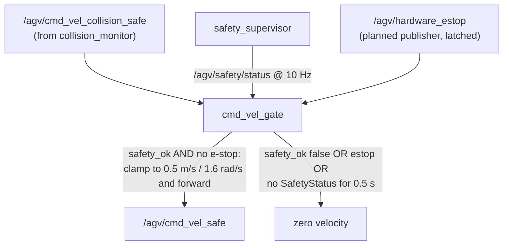

# Safety model

This page describes the software safeguards that stand between a velocity
command and the motors — and, just as importantly, what they do **not**
guarantee.

!!! danger "Operational safeguards — NOT certified functional safety"
    Everything on this page is software running on a single computer with a
    single forward-facing camera. Per
    [SECURITY.md](https://github.com/AndresIslas99/NavGreen/blob/main/SECURITY.md)
    and Rule 6 of the
    [engineering rules](https://github.com/AndresIslas99/NavGreen/blob/main/policies/engineering_rules.md):
    the collision monitor, mode arbitration, and software e-stop paths are
    operational safeguards. Certified human safety requires dedicated
    safety-rated hardware — scanners, PLC/relay logic — and a compliance
    process, all outside this repository's scope. Do not describe or deploy
    this stack as a certified safety system.

## The chain, and its fail-safe default

In production (`has_map=true`), every command passes:

```
mode_arbiter -> /agv/cmd_vel -> velocity_smoother -> collision_monitor
  -> /agv/cmd_vel_collision_safe -> cmd_vel_gate -> /agv/cmd_vel_safe -> agv_odrive
```

The last software element before the motor driver is the
[`agv_safety`](https://github.com/AndresIslas99/NavGreen/blob/main/src/agv_safety/CLAUDE.md)
`cmd_vel_gate`, and its defining property is the **fail-safe default**:



- If `safety_ok` is false, output is zero.
- If `hardware_estop` is asserted, output is zero.
- If **no `SafetyStatus` arrives for `safety_timeout_s` (0.5 s)** — i.e. the
  supervisor itself crashed — output is zero.
- Otherwise the command is clamped to `max_linear: 0.5` / `max_angular: 1.6`
  (deliberately just above Nav2's own caps, well under the platform's
  kinematic limits) and forwarded.

## Supervisor liveness

The `safety_supervisor` watches a configurable list of critical topics
through type-erased generic subscriptions and drops `safety_ok` when any of
them misses its deadline
([`safety_params.yaml`](https://github.com/AndresIslas99/NavGreen/blob/main/src/agv_safety/config/safety_params.yaml)):

| Monitored topic | Expected rate | Deadline |
|---|---|---|
| `/agv/wheel_odom` | 50 Hz | 100 ms |
| `/agv/odometry/global` | 10 Hz | 250 ms |
| `/agv/scan` | ~10 Hz | 250 ms |

A latched `software_estop` input also forces `safety_ok=false`. A startup
grace window (`startup_grace_ms: 3000`) tolerates topics not yet seen during
bringup.

!!! warning "Only monitor topics that publish continuously"
    The supervisor is a freshness watchdog, so **event-driven topics must
    never be in its monitored list**. Nav2's `/agv/collision_monitor_state`
    only publishes while cmd_vel flows through the Nav2 chain; with the robot
    at rest in teleop it is silent by design. It was once in the monitored
    list, and the result was the 2026-04-13 "teleop-broken" incident: the
    supervisor marked it stale, the gate zeroed every command, and teleop
    died with no error anywhere. Collision-monitor liveness is instead
    checked at boot by `agv_healthcheck.sh` and continuously by the
    backend's goal-dispatch freshness watchdog. The invariant is codified in
    [`specs/state_machine.yaml`](https://github.com/AndresIslas99/NavGreen/blob/main/specs/state_machine.yaml)
    (`safety_chain_never_silent_on_idle`).

## The collision monitor

Nav2's collision monitor runs upstream of the gate with two polygons whose
sizes are **derived from stopping-distance physics, not tuning**
([`collision_monitor.yaml`](https://github.com/AndresIslas99/NavGreen/blob/main/src/agv_navigation/config/collision_monitor.yaml)):

| Zone | Extent | Action | Trigger |
|---|---|---|---|
| `stop_zone` | footprint + 20 cm forward (x to 0.70 m, y ±0.42 m) | stop | **1 point** — any single hit stops the robot |
| `slowdown_zone` | footprint + 50 cm forward (x to 1.00 m, y ±0.55 m) | slow to 30 % | 2 points |

The 20 cm stop margin comes from worst-case math at 0.4 m/s: stopping
distance `v²/2a` = 8 cm at 1.0 m/s² deceleration, plus ~4 cm of reaction
latency, plus an 8 cm margin. On top of that, MPPI's `vx_max` is capped at
**0.25 m/s**, where the actual stopping distance is ~6 cm — comfortably
inside the margin, with 2.5× less kinetic energy than at 0.4 m/s.

Two independent observation sources feed the polygons: `/agv/scan` (the 2D
laser slice derived from ZED depth) and the raw 3D point cloud
(`min_height: -0.20`, `max_height: 2.00` — it also catches overhead and
floor-level obstacles the 2D slice misses). `source_timeout` is 0.5 s: a
stalled sensor source triggers a stop rather than silence. In HIL mode the
pointcloud source is dropped (WiFi bandwidth), leaving the scan source
active — production behavior is untouched.

The backend adds a fifth layer: it watches `/agv/collision_monitor_state`
freshness and refuses to dispatch nav goals when the safety chain has gone
silent.

### The blind zone no software can fix

The ZED 2i cannot return depth closer than 0.30 m. With the camera mounted
0.70 m forward on the chassis, it perceives obstacles only from ~1.0 m ahead
of `base_link` — and the robot's front edge is at 0.50 m. **Anything placed
within ~50 cm of the robot's front while it is moving toward it is
invisible to every safeguard on this page.** This is a hardware limit,
documented for operator training, with recommended hardware additions (2D
lidar at shin height, bumper switches wired into the ODrive e-stop circuit,
or a ToF array) in
[`agv_navigation/CLAUDE.md`](https://github.com/AndresIslas99/NavGreen/blob/main/src/agv_navigation/CLAUDE.md).
The same forward-only reality is why Nav2 is configured with no reverse
motion at all — see
[Navigation & modes](navigation-and-modes.md#nav2-configuration).

## E-stop paths

There are three stop channels, at different maturity levels
([`specs/interfaces.yaml`](https://github.com/AndresIslas99/NavGreen/blob/main/specs/interfaces.yaml)):

| Topic | Status | Consumer | Semantics |
|---|---|---|---|
| `/agv/e_stop` (Bool, reliable) | **Active** | `agv_odrive` — the primary stop path | `true` disables the motors and ignores cmd_vel until `false`. Published by the dashboard backend; the VDA 5050 fleet adapter can also assert it (`emergencyStop` instant action). |
| `/agv/hardware_estop` (Bool, reliable + transient_local) | Subscriber implemented in `cmd_vel_gate`; **publisher planned** (future bumper / ODrive estop-pin bridge) | `cmd_vel_gate` — forces zero output while true | Latched: transient_local durability means a late-restarting gate still receives an e-stop published before it started. Initializes `false`, so the absence of a publisher does not block motion. |
| `/agv/software_estop` (Bool, reliable + transient_local) | Subscriber implemented in `safety_supervisor`; **publisher planned** | `safety_supervisor` — latched `safety_ok=false` | Same latched QoS contract. |

!!! warning "QoS contract for e-stop publishers"
    DDS rejects a `volatile` (default-durability) publisher against a
    `transient_local` subscription — a future e-stop bridge publishing
    `std_msgs/Bool` with default QoS would **never connect and be silently
    ignored**. Any publisher on `/agv/hardware_estop` or
    `/agv/software_estop` must use `reliability: reliable` +
    `durability: transient_local`.

Two operational details worth knowing:

- Publishing `/agv/e_stop` from the CLI stops the robot but does **not**
  update the dashboard backend's internal state — the UI keeps showing
  `e_stop` until `POST /api/recovery/clear_estop` runs. Use the API, not raw
  topic pubs, to clear.
- The acceptance gate for the hardware requires e-stop command-to-stop
  **≤ 0.2 s**, and the end-to-end teleop gate requires the dashboard e-stop
  to halt the wheels and latch the state until cleared
  ([`specs/acceptance.yaml`](https://github.com/AndresIslas99/NavGreen/blob/main/specs/acceptance.yaml)).

## Always able to stop: unauthenticated stop endpoints

Dashboard authentication (JWT, role-based) is available and should be enabled
before any field deployment — but even with auth on, three **stop-type
endpoints are deliberately exempt**:

- `POST /api/recovery/trigger_estop`
- `POST /api/nav/cancel`
- `POST /api/missions/pause`

Rationale: stopping the robot must always be possible for anyone on the
local network, mirroring a physical stop control. The corresponding
*clearing/arming* actions (`/api/recovery/clear_estop`, motor enable, goal
dispatch) stay role-gated. The full contract is in
[`specs/hmi_api.yaml`](https://github.com/AndresIslas99/NavGreen/blob/main/specs/hmi_api.yaml);
the deployment security posture (isolated LAN, auth disabled by default, no
default accounts) is in the [security policy](../community/security.md).

## Behavioral safeguards

Beyond the velocity chain, two mode-level mechanisms reduce risk around the
crop rows:

- The mode arbiter forces **`blocked_handoff`** (zero cmd_vel from any
  state) whenever the collision monitor reports STOP, recovering only when
  the signal clears.
- Inside rail aisles, the rail driver's **`angular.z == 0` hard lock** and
  the arbiter's RAIL_EXIT release gate keep Nav2's rotation sampling away
  from the 51 mm rail tubes entirely.

Both are detailed in [Navigation & mode arbitration](navigation-and-modes.md).

## Known gaps, honestly

These are documented in the specs rather than hidden:

- **`cmd_vel_gate` does not consume `/agv/e_stop`.** The operator e-stop
  acts on the ODrive node directly; wiring it into the gate as
  defense-in-depth is a documented follow-up, not current behavior.
- **The C++ `agv_waypoint_manager` mission executor and the fleet VDA 5050
  adapter dispatch `/agv/navigate_to_pose` goals directly**, bypassing the
  backend's localization/motors/collision-freshness gates. The dashboard's
  own mission executor is gated; unifying the paths is tracked follow-up
  work (see the `known_gap` entries in
  [`specs/interfaces.yaml`](https://github.com/AndresIslas99/NavGreen/blob/main/specs/interfaces.yaml)).
- **No safety chain without a map.** In the mapping-first branch
  (`has_map=false`) the ODrive consumes `/agv/cmd_vel` directly with no
  collision protection — acceptable for commissioning teleop at low speed,
  and not reachable in normal production boot, but real.
- **The ~50 cm frontal blind zone** described above, open until additional
  hardware is fitted.

If you find a new gap, follow the
[security policy](../community/security.md) for anything exploitable, or the
audit-and-specs process in [The spec system](spec-system.md) for behavioral
drift.
