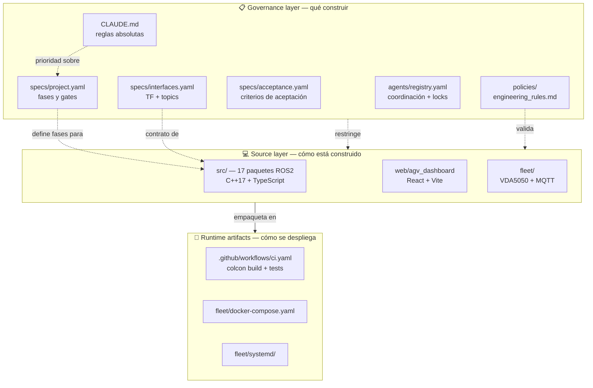
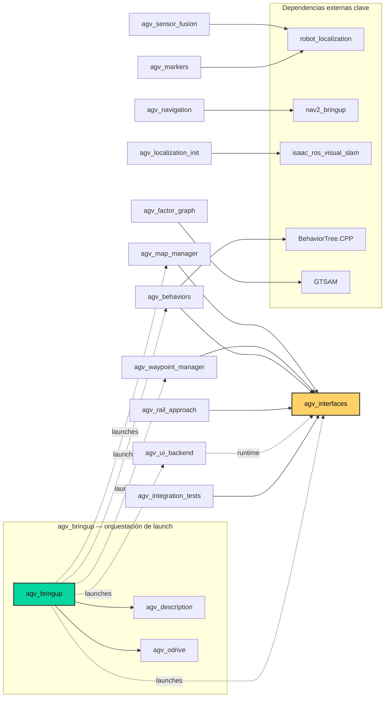
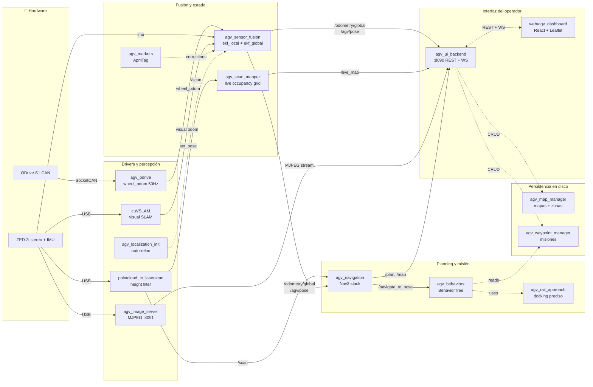

# AGV Greenhouse — Code Structure

Este documento describe **cómo está organizado el código del repositorio**: árbol
de directorios, inventario de paquetes ROS2, dependencias entre paquetes y flujo
de datos end-to-end.

Para los pipelines de runtime (dual EKF, Nav2, TF tree, startup sequence), ver
[`docs/architecture.md`](./architecture.md). Este documento es complementario:
`architecture.md` explica *qué hace el robot en vivo*, este archivo explica
*cómo está organizado el código fuente*.

## 1. Árbol de directorios top-level

```
agv-greenhouse/
├── specs/                  # Fuente de verdad del diseño
│   ├── project.yaml        # Fases, gates, metas MVP
│   ├── interfaces.yaml     # TF tree, topics, rates, namespaces
│   └── acceptance.yaml     # Criterios de aceptación por fase
│
├── policies/               # Reglas de ingeniería
│   └── engineering_rules.md
│
├── agents/                 # Coordinación multi-agente
│   └── registry.yaml       # architect/refactor/generator + file locks
│
├── src/                    # 17 paquetes ROS2 (ver §3)
│   └── agv_*               # C++17 para nodos de robot, TS para UI backend
│
├── fleet/                  # Fleet coordination (post-MVP)
│   ├── agv_fleet_manager/  # Broker de flota (stub)
│   ├── agv_vda5050_adapter/# Adaptador VDA 5050
│   ├── mosquitto/          # Broker MQTT
│   ├── docker-compose.yaml
│   ├── systemd/
│   └── start_fleet.sh
│
├── web/                    # Frontend del operador
│   └── agv_dashboard/      # React + Vite + Leaflet
│
├── docs/                   # Documentación de arquitectura
│   ├── architecture.md             # Pipelines de runtime
│   ├── code_structure.md           # (este archivo)
│   ├── hardware_setup.md           # CAN + Jetson pinmux
│   ├── dual_ekf_validation.md
│   ├── hil_validation.md
│   ├── mapping_commissioning.md
│   ├── odrive_low_speed_tuning.md
│   ├── low_speed_validation.md
│   └── production_readiness_assessment.md
│
├── .github/workflows/      # CI: colcon build + tests + warnings-as-errors
│
├── CLAUDE.md               # Reglas absolutas del proyecto (orden canónico)
├── AGENTS.md               # Referencia para agentes Claude Code / Aider
├── README.md               # Quick start
└── STATUS.yaml             # Phase tracking
```

## 2. Diagrama de capas

El repositorio se divide en tres capas conceptuales: **governance** (qué debe
construirse), **source** (cómo está construido) y **runtime artifacts** (cómo
se despliega).



## 3. Inventario de paquetes en `src/`

17 paquetes ROS2. Todos los nodos de robot son **C++17** (regla 0 de
`policies/engineering_rules.md`). Python queda reservado para herramientas
`dev_only`. `agv_ui_backend` es TypeScript con `rclnodejs` (ver
[`src/agv_ui_backend/CLAUDE.md`](../src/agv_ui_backend/CLAUDE.md)).

| # | Package | Lang | Rol | Depende internamente de |
|---|---------|------|-----|-------------------------|
| 1 | **agv_interfaces** | IDL | Definiciones de mensajes y servicios (SaveMap, LoadMap, ExecuteMission, RailApproach, etc.) | — |
| 2 | **agv_description** | Xacro/URDF | Geometría del robot y cadena TF (`base_link`, wheels, ZED) | — |
| 3 | **agv_odrive** | C++17 | Driver CAN ODrive S1 + wheel odometry @ 50 Hz | — |
| 4 | **agv_sensor_fusion** | C++17 | Dual EKF (local 50 Hz + global 10 Hz) vía `robot_localization` | — |
| 5 | **agv_navigation** | Nav2 config | Configuración Nav2 + collision monitor + costmaps | — |
| 6 | **agv_behaviors** | C++17 + BT XML | Ejecutor de misiones con BehaviorTree.CPP | `agv_interfaces` |
| 7 | **agv_map_manager** | C++17 | Persistencia de mapas y zonas en disco | `agv_interfaces` |
| 8 | **agv_waypoint_manager** | C++17 | CRUD de misiones y dispatch secuencial | `agv_interfaces` |
| 9 | **agv_markers** | C++17 | Corrección de deriva vía AprilTag (tag36h11) | — |
| 10 | **agv_scan_mapper** | C++17 | Occupancy grid en vivo desde `LaserScan` | — |
| 11 | **agv_image_server** | C++17 | Streams MJPEG HTTP (cámara + depth heatmap) en `:8091` | — |
| 12 | **agv_localization_init** | C++17 | Orquestador de auto-localización (cuVSLAM + AprilTag) | — |
| 13 | **agv_rail_approach** | C++17 | Aproximación de precisión vía AprilTag para docking | `agv_interfaces` |
| 14 | **agv_factor_graph** | C++17 | Fusión con factor graph GTSAM (reemplazo futuro de `ekf_global`) | — |
| 15 | **agv_ui_backend** | TypeScript | Bridge ROS2↔Web: REST + WebSocket + state machine, puerto `:8090` | `agv_interfaces` *(runtime)* |
| 16 | **agv_bringup** | Python launch | Orquestación de lanzamiento (teleop, mapping, fusion modes) | `agv_description`, `agv_odrive` |
| 17 | **agv_integration_tests** | Python (`dev_only`) | Tests de integración system-level | `agv_interfaces` |

> **Nota:** Las dependencias internas fueron extraídas de las etiquetas
> `<depend>` / `<exec_depend>` en cada `package.xml`. Para `agv_ui_backend`,
> la dependencia sobre `agv_interfaces` es a nivel de runtime (rclnodejs) y
> no aparece en `package.xml`.

## 4. Grafo de dependencias entre paquetes

`agv_interfaces` es el hub de tipos compartidos — todo paquete que expone
servicios a otros paquetes depende de él. `agv_bringup` es el hub de
orquestación: agrupa los drivers y nodos en modos de lanzamiento.



**Observaciones clave:**

- **`agv_interfaces` es el único acoplamiento fuerte** entre paquetes. Todos
  los demás nodos se comunican por topics/actions/services, no por código
  compartido.
- **`agv_sensor_fusion`, `agv_navigation`, `agv_scan_mapper`, `agv_image_server`,
  `agv_odrive`, `agv_localization_init` y `agv_factor_graph`** no tienen
  dependencias internas: son paquetes auto-contenidos que consumen topics del
  resto del sistema.
- **`agv_bringup`** es el punto de entrada: lanza toda la stack en modos
  configurables (teleop-only, mapping, full).

## 5. Flujo de datos end-to-end

Desde el hardware hasta la UI del operador. Las líneas sólidas son flujos de
datos (topics/actions), las punteadas son interacciones laterales (servicios,
persistencia).



## 6. Lenguajes y políticas de código

| Capa | Lenguaje | Justificación |
|------|----------|---------------|
| Nodos ROS2 de robot | **C++17 exclusivamente** | Regla 0 de `policies/engineering_rules.md`. Deterministic runtime en Jetson. |
| UI backend | TypeScript + `rclnodejs` | WebSocket + REST. Fuera de la hot path del robot. |
| Frontend | TypeScript + React + Vite | SPA servida por `agv_ui_backend` en `/dashboard`. |
| Launch orchestration | Python (`launch_ros`) | Estándar ROS2; no es un nodo runtime. |
| Integration tests | Python (`dev_only`) | Herramientas de dev, reemplazables antes de producción. |

**Reglas críticas** (de `CLAUDE.md`):

- `robot_namespace` siempre desde parámetro (default: `agv`). Nunca hardcoded.
- Marker IDs, IPs de Jetson, parámetros físicos siempre desde YAML o env.
- Build warnings son errores.
- No Python ROS2 nodes en la stack runtime.

## 7. Referencias cruzadas

| Pregunta | Dónde buscar |
|----------|--------------|
| ¿Qué hace el robot en runtime? | [`docs/architecture.md`](./architecture.md) |
| ¿Cuál es la fase actual y qué gates faltan? | [`specs/project.yaml`](../specs/project.yaml), [`STATUS.yaml`](../STATUS.yaml) |
| ¿Qué topics y frames TF existen? | [`specs/interfaces.yaml`](../specs/interfaces.yaml) |
| ¿Cómo se aceptan los entregables? | [`specs/acceptance.yaml`](../specs/acceptance.yaml) |
| ¿Qué reglas siguen los agentes Claude/Aider? | [`agents/registry.yaml`](../agents/registry.yaml), [`AGENTS.md`](../AGENTS.md) |
| ¿Por qué C++17 y no Python? | [`policies/engineering_rules.md`](../policies/engineering_rules.md) |
| ¿Cómo configurar CAN + ODrive + Jetson? | [`docs/hardware_setup.md`](./hardware_setup.md) |
| ¿Qué hace `agv_ui_backend` internamente? | [`src/agv_ui_backend/CLAUDE.md`](../src/agv_ui_backend/CLAUDE.md) |
