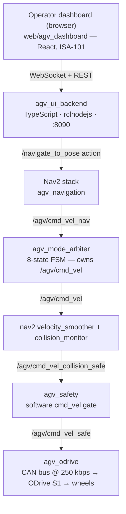

# NavGreen

**Autonomous navigation for greenhouse robots.**

NavGreen is the full software stack of an autonomous differential-drive AGV
built for commercial greenhouse operation in Mexico. It is a production-grade
ROS 2 workspace, not a demo: every robot node is C++17 compiled with
`-Werror`, localization is a dual-EKF fusing 50 Hz wheel odometry with GPU
visual SLAM (cuVSLAM) and AprilTag (tag36h11) pose corrections, autonomy runs
on Nav2, and a dedicated rail-riding mode drives the robot along the
heating-pipe rails between crop rows. A software safety chain gates velocity
commands before they reach the motors, operators work from a browser
dashboard over local WiFi, and an optional VDA 5050 layer connects the robot
to a fleet master.

!!! note "One project, two names"
    **NavGreen** is the project name. The GitHub repository is
    [`AndresIslas99/agv-greenhouse`](https://github.com/AndresIslas99/agv-greenhouse)
    and the code keeps its literal identifiers — packages are `agv_*`
    (`agv_sim`, `agv_bringup`, …) and topics live under `/agv/`
    (`/agv/cmd_vel`, …). When these docs show a literal name, it matches the
    code exactly.

In production (map loaded), every velocity command flows through one
auditable chain:



## Why NavGreen is different

### The specs are the single source of truth

The most distinctive part of this workspace is not a node — it is the
contract system around the nodes. Machine-readable specs in
[`specs/`](https://github.com/AndresIslas99/agv-greenhouse/tree/main/specs)
describe every topic, service, action, operation mode, launch step, and
persistent file. If a spec and the code disagree, one of them is a bug — and
nine verifiers (5 BLOCKING, 4 WARNING) catch the disagreement, both as a
pre-commit hook and as a dedicated CI job:

```bash
bash tools/verify_specs/all.sh
```

Seven contracts cover the whole system — interfaces (topic/service/action
types, QoS, owners), the mode state machine, the startup DAG, persistent
artifacts, the dashboard HTTP/WebSocket API, acceptance gates, and the
project constants. The full spec-by-spec breakdown is in
[The spec system](architecture/spec-system.md#the-contracts).

A commit that adds a topic without updating `specs/interfaces.yaml` is
rejected. This is what lets humans — and AI coding agents, which get their
own specs-first workflow in
[`AGENT_INSTRUCTIONS.md`](https://github.com/AndresIslas99/agv-greenhouse/blob/main/AGENT_INSTRUCTIONS.md)
— answer "who owns the `map → odom` transform?" without reading C++.
[Read how the spec system works →](architecture/spec-system.md)

### Honest engineering

NavGreen documents what is weak as carefully as what works:

- Known architecture debt lives in a dedicated, blunt document —
  [`docs/architectural_gaps.md`](https://github.com/AndresIslas99/agv-greenhouse/blob/main/docs/architectural_gaps.md)
  — and the full pre-release review ledger, including **open, unfixed
  findings**, is published in the
  [community-readiness review](reviews/2026-07-06-community-readiness-review.md).
- The software safeguards (collision monitor, mode arbitration, software
  E-stop paths) are explicitly **not certified functional safety**, and the
  docs never claim otherwise. See the [safety model](architecture/safety.md).
- The in-repo simulation (`agv_sim`) is drivetrain-only — physics and two
  wheels, no cameras or lidar — and its docs say so instead of overselling it.
- The specs were produced by a full workspace audit
  ([2026-04-13](https://github.com/AndresIslas99/agv-greenhouse/blob/main/docs/audit/2026-04-13-full-audit.md)),
  and any future drift between specs and reality must update both the audit
  trail and the specs together.

## Start here

<div class="grid cards" markdown>

-   **Getting started**

    ---

    From zero to a built workspace and a running simulation — via the dev
    container or a native ROS 2 Humble install. No robot required.

    [Getting started →](getting-started.md)

-   **Drive the robot in simulation**

    ---

    Spawn the AGV in Gazebo Classic and drive it with your keyboard:
    `ros2 launch agv_sim teleop_sim.launch.py`.

    [Drive in simulation →](tutorials/drive-in-simulation.md)

-   **Architecture overview**

    ---

    How the command chain, dual-EKF localization, mode arbitration, and the
    rail stack fit together.

    [Architecture →](architecture/overview.md)

</div>

## Project status

NavGreen is a working engineering codebase, honestly mid-journey:

- **Target deployment**: a commercial greenhouse in Mexico. The core stack is
  implemented and validated hardware-in-the-loop (HIL); per
  [`specs/project.yaml`](https://github.com/AndresIslas99/agv-greenhouse/blob/main/specs/project.yaml),
  field validation on the physical robot is the current milestone. The MVP
  scope is the first field visit: teleoperation, map commissioning, waypoint
  missions, and live monitoring from a browser tablet over local WiFi.
- **CI is green** ([workflow](https://github.com/AndresIslas99/agv-greenhouse/blob/main/.github/workflows/ci.yaml)),
  with four jobs:
    - **Spec verification** — the same `tools/verify_specs/all.sh` suite as
      the pre-commit hook.
    - **Build and test** — 20 of the 25 first-party packages build with
      `-Werror` on stock ROS 2 Humble, then `colcon test` runs.
    - **TypeScript** — the operator backend builds against rclnodejs; the
      dashboard type-checks, runs its tests, and bundles; the fleet packages
      build and the fleet manager runs its tests.
    - **Simulation** — `agv_sim` builds, its URDF must expand cleanly, and the
      production controller stack must reach `active` with mock hardware
      (blocking); headless Gazebo world-load + robot-spawn runs as a
      best-effort check.
- **Not built in CI**: `agv_map_manager`, `agv_localization_init`, and
  `agv_factor_graph` need vendor SDKs (NVIDIA Isaac ROS, ZED, GTSAM) that are
  not on public apt; `agv_bringup` depends on all three. See
  [getting started](getting-started.md#the-vendor-sdk-caveat).
- **Hardware**: Jetson AGX Orin 64GB (development) / Jetson Orin NX 16GB
  (production), 2× BLDC motors on ODrive S1 over CAN, ZED 2i stereo camera,
  AprilTag tag36h11 markers.

## Community

- **Contributing** — the [contributing guide](community/contributing.md)
  covers the specs-first workflow, the C++17 ground rules, and how to get a
  change merged. AI coding agents start at
  [`AGENT_INSTRUCTIONS.md`](https://github.com/AndresIslas99/agv-greenhouse/blob/main/AGENT_INSTRUCTIONS.md).
- **Roadmap** — open work is tracked in the [roadmap](community/roadmap.md)
  and in the tracking issue
  [#18](https://github.com/AndresIslas99/agv-greenhouse/issues/18)
  (post-community-review follow-ups).
- **Security** — read the [security notes](community/security.md) before any
  deployment: the stack assumes an isolated greenhouse LAN, and dashboard
  authentication is disabled by default.
- **License** — [MIT](https://github.com/AndresIslas99/agv-greenhouse/blob/main/LICENSE)
  © 2026 Andres Islas.
