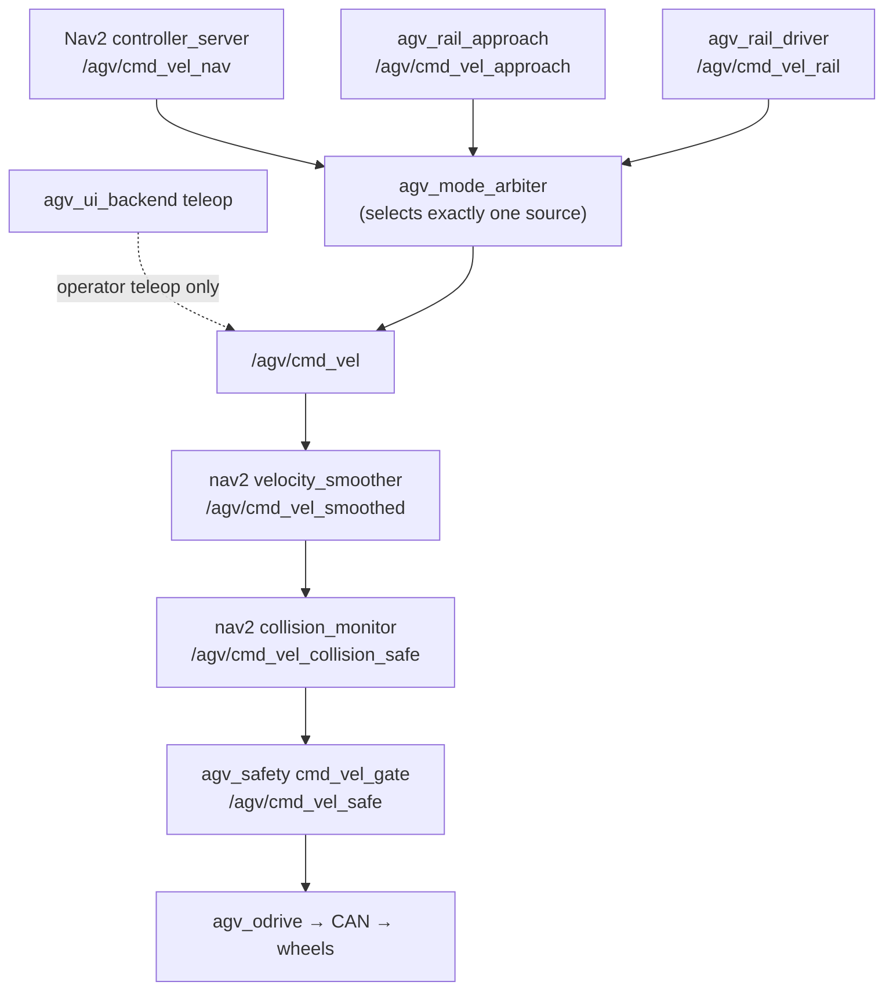

# Interfaces & specs

Every ROS 2 topic, service, and action that crosses a package boundary in
NavGreen is declared in
[`specs/interfaces.yaml`](https://github.com/AndresIslas99/agv-greenhouse/blob/main/specs/interfaces.yaml).
That file is the contract — the Single Source of Truth (SSOT). If the code and
the spec disagree, one of them is a bug, and a verifier will block the commit
until they agree again.

This page teaches you how to *read* the spec, not replace it. When you need
the authoritative QoS, rate, or subscriber list for an interface, open the
YAML — it is designed to be read directly.

## Anatomy of a contract entry

Here is the real entry for the wheel-odometry topic, trimmed:

```yaml
- name: "/agv/wheel_odom"
  type: "nav_msgs/msg/Odometry"
  owner_pkg: "agv_odrive"
  owner_node: "agv_odrive_node"
  code_ref: "src/agv_odrive/src/odrive_can_node.cpp (pub_odom_)"
  qos: {reliability: "reliable", history: "keep_last", depth: 10}
  rate_hz: {min: 40, target: 50, max: 55}
  subscribers:
    - {pkg: "agv_sensor_fusion", node: "wheel_slip_detector",
       role: "input for slip detection; republished as /agv/wheel_odom_validated"}
    - {pkg: "agv_ui_backend", node: "teleop_server",
       role: "dashboard velocity + Hz tracking"}
  hil_override:
    owner_pkg: "agv_hil_bridges"
    owner_node: "joint_states_to_wheel_odom"
```

Field by field:

| Field | Meaning |
|---|---|
| `name` | Absolute topic/service/action name. All AGV interfaces live under the `/agv/` namespace (default `robot_namespace`); names outside it belong to external packages (cuVSLAM, nvblox) |
| `type` | Full message/service/action type. The subscriber's type must match the publisher's — a mismatch here caused a real field bug on `/agv/collision_monitor_state` |
| `owner_pkg` / `owner_node` | Exactly one package/node owns each interface. Owners prefixed `sim_host:` live in the separate `agv-greenhouse-sim` repo and are declared here only for brain-side consumers |
| `code_ref` | Where in the source the owner creates the interface — your entry point when reading the implementation |
| `qos` | Reliability, durability, history, depth. Latched topics say `durability: "transient_local"` |
| `rate_hz` | Expected publish rate as `{min, target, max}` where it matters |
| `publishers` / `alternative_publishers` | Who else may publish, and under which condition (`active_when`, `role`) |
| `subscribers` / `callers` | Every consumer, with its role. This is how you answer "who breaks if I change this?" |
| `status: planned` | Spec-only placeholder: the topic is designed (often with a subscriber already implemented) but no publisher exists yet |
| `hil_override` | Who owns the topic in hardware-in-the-loop runs, when the production owner is hardware-bound |
| `notes` | History, fixed bugs, and honestly documented `known_gap`s |

The spec also declares **TF ownership** at the top: `map→odom` belongs to
`ekf_global`, `odom→base_link` to `ekf_local` (both in `agv_sensor_fusion`),
and `base_link→children` to `robot_state_publisher` — single publisher each,
by invariant.

## The velocity command chain

The most important set of contracts is the `cmd_vel` chain — how a velocity
command travels from a controller to the wheels:



`agv_mode_arbiter` is the single owner of `/agv/cmd_vel`: upstream controllers
publish to per-controller topics and the arbiter relays exactly one. In
map-less mode, `agv_odrive` consumes `/agv/cmd_vel` directly (no Nav2 chain).

## The interfaces you will meet first

Verified against `specs/interfaces.yaml` — but always check the spec for the
full entry.

### Topics

| Name | Type | Owner | Notes |
|---|---|---|---|
| `/agv/cmd_vel` | `geometry_msgs/msg/Twist` | `agv_mode_arbiter` | Arbitrated velocity command, target 20 Hz. `teleop_server` publishes directly only during operator teleop |
| `/agv/cmd_vel_nav` / `_approach` / `_rail` | `geometry_msgs/msg/Twist` | Nav2 / `agv_rail_approach` / `agv_rail_driver` | Per-controller inputs to the arbiter. `cmd_vel_rail` has `angular.z` hard-coded to 0 |
| `/agv/cmd_vel_safe` | `geometry_msgs/msg/Twist` | `agv_safety` (`cmd_vel_gate`) | Final motor command — the last software element before the driver |
| `/agv/wheel_odom` | `nav_msgs/msg/Odometry` | `agv_odrive` | 50 Hz wheel odometry, reliable QoS. In HIL, `agv_hil_bridges` owns it instead |
| `/agv/wheel_odom_validated` | `nav_msgs/msg/Odometry` | `agv_sensor_fusion` (`wheel_slip_detector`) | Same payload with slip-aware covariance inflation; this (not the raw topic) feeds `ekf_local` |
| `/agv/odometry/global` | `nav_msgs/msg/Odometry` | `robot_localization` (`ekf_global`) | The fused `map`-frame estimate, 10 Hz — consumed by Nav2, the dashboard, the mode arbiter, and the fleet adapter |
| `/agv/motor_state` | `std_msgs/msg/String` | `agv_odrive` | JSON motor telemetry: axis states, errors, bus voltage/current, temperatures, `armed`, `feedback_ok` (CAN feedback-loss watchdog) |
| `/agv/e_stop` | `std_msgs/msg/Bool` | `agv_ui_backend` | Operator e-stop: `true` means immediate stop and persists until `false`. Consumed by `agv_odrive` (motor disable, primary stop path). The fleet adapter also publishes it for VDA 5050 `emergencyStop` |
| `/agv/hardware_estop` | `std_msgs/msg/Bool` | *planned* | QoS `reliable` + `transient_local`, so a latched publisher asserts the stop across gate restarts. The `cmd_vel_gate` subscription is already implemented; the hardware publisher does not exist yet |
| `/agv/software_estop` | `std_msgs/msg/Bool` | *planned* | Same `reliable` + `transient_local` pattern; `safety_supervisor` subscription implemented, operator-side publisher is the missing piece |
| `/agv/live_map`, `/agv/map` | `nav_msgs/msg/OccupancyGrid` | `agv_scan_mapper` / nav2 `map_server` | Latched (`transient_local`, depth 1) so late subscribers get the last grid |

!!! note "E-stop wiring is documented honestly"
    The spec records that `cmd_vel_gate` does **not** subscribe `/agv/e_stop`
    — the operator e-stop acts directly on the ODrive node, and the gate's
    stop inputs are `safety_status` and `/agv/hardware_estop`. Routing the
    e-stop through the gate as defense-in-depth is a documented follow-up,
    not current behavior. This is exactly the kind of fact the spec exists to
    keep truthful.

### Services

| Name | Type | Owner | Notes |
|---|---|---|---|
| `/agv/set_pose` | `robot_localization/srv/SetPose` | `ekf_global` **only** | The launch remaps `ekf_local`'s `set_pose` away so the shared name cannot nondeterministically land on the local filter. Callers: `agv_markers` (AprilTag relocalization) and `agv_localization_init` (pose seeding) |
| `/agv/map_manager/save_map` / `load_map` | `agv_interfaces/srv/SaveMap` / `LoadMap` | `agv_map_manager` | Map names validated to 1–64 chars of `[A-Za-z0-9_-]`. Known drift: the dashboard save path bypasses this service (documented in the spec) |
| `/agv/localization/reinitialize` | `std_srvs/srv/Trigger` | `agv_localization_init` | Operator recovery when localization reports `FAILED` |
| `/agv/rail_approach/execute` | `agv_interfaces/srv/RailApproach` | `agv_rail_approach` | Called by the mode arbiter on rail-approach handoff and by the dashboard |

### Actions

| Name | Type | Owner | Notes |
|---|---|---|---|
| `/agv/navigate_to_pose` | `nav2_msgs/action/NavigateToPose` | nav2 `bt_navigator` | The canonical goal-dispatch action. The spec lists each caller **with its gates**: `agv_ui_backend` checks mode, motors armed, localization state, and collision-monitor freshness before sending; `agv_waypoint_manager` and the fleet adapter bypass those gates — both recorded as `known_gap` |

## How the verifiers enforce this

The spec header names its enforcement script:

```yaml
verified_by: "tools/verify_specs/verify_interfaces.py"
```

`verify_interfaces.py` is part of the BLOCKING set in
[`tools/verify_specs/all.sh`](https://github.com/AndresIslas99/agv-greenhouse/blob/main/tools/verify_specs/all.sh)
(5 BLOCKING + 4 WARNING checks). It runs as a pre-commit hook and as the
`spec-verification` CI job on every push and PR. It performs four static
checks, all blocking:

1. **Owner presence** — every workspace-owned interface name must appear as a
   *quoted string literal* in the owner package (or a launch remap). Comment
   mentions don't count.
2. **Declared-consumer presence** — every listed subscriber/caller must
   reference the name in its own package, catching "spec says X subscribes,
   code subscribes something else".
3. **Type presence** — the declared message/service/action class must appear
   in the owner package.
4. **Reverse pass** — every absolute `/agv/...` literal passed to a
   publisher/subscription/service/client/action creation call in `src/` or
   `fleet/` must be declared in the spec. Undeclared interfaces block the
   commit.

Entries with `status: planned` skip checks 1 and 3 (no implementation exists
yet) but their declared consumers *are* checked.

!!! warning "What the verifier does not check"
    It is a static, lexical check. It does not verify QoS depths at runtime,
    dynamic remappings, or rates — those remain review responsibilities. It
    exists to catch name and type drift, the failure modes actually observed
    in the 2026 audits.

## Updating the spec

If your change adds, removes, or renames any cross-package interface, update
`specs/interfaces.yaml` **in the same commit** — the pre-commit hook and CI
reject the change otherwise:

```bash
bash tools/verify_specs/all.sh   # run the whole suite locally
```

Related contracts live in sibling files:
[`specs/hmi_api.yaml`](https://github.com/AndresIslas99/agv-greenhouse/blob/main/specs/hmi_api.yaml)
(dashboard REST/WebSocket — authoritative for the HMI surface),
[`specs/state_machine.yaml`](https://github.com/AndresIslas99/agv-greenhouse/blob/main/specs/state_machine.yaml),
[`specs/launch_sequence.yaml`](https://github.com/AndresIslas99/agv-greenhouse/blob/main/specs/launch_sequence.yaml),
and
[`specs/persistence.yaml`](https://github.com/AndresIslas99/agv-greenhouse/blob/main/specs/persistence.yaml).
Start with the reading order in
[`specs/README.md`](https://github.com/AndresIslas99/agv-greenhouse/blob/main/specs/README.md),
and see [the spec system](../architecture/spec-system.md) for the design
rationale.
