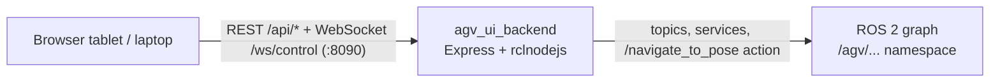

# Run the operator dashboard

NavGreen's operator HMI is a browser app: a React dashboard
(`web/agv_dashboard`) talking to a TypeScript bridge server
(`src/agv_ui_backend`) that sits on the ROS 2 graph via
[rclnodejs](https://github.com/RobotWebTools/rclnodejs). This tutorial builds
both and brings them up on your machine.



| Component | Stack | Port |
|-----------|-------|------|
| `src/agv_ui_backend` | Express + rclnodejs + WebSocket | **8090** (`AGV_PORT`) |
| `web/agv_dashboard` | React + TypeScript + Vite | served by the backend at `:8090/dashboard`, or `:5173` in dev |
| `agv_image_server` (camera MJPEG, optional) | C++ | 8091 |

!!! note "You can run the UI without a robot — it will just say so"
    The backend subscribes to production topics under the `/agv/...`
    namespace (`/agv/wheel_odom`, `/agv/scan`, `/agv/live_map`, ...). With no
    robot and no HIL bridge publishing them, the dashboard loads fine but the
    robot state stays **offline**. The
    [Gazebo sim](drive-in-simulation.md) does *not* feed it either — `agv_sim`
    is deliberately un-namespaced (`/odom`, not `/agv/wheel_odom`). This
    tutorial is still worth doing without hardware: you exercise the whole
    build, auth, and serving path.

## Prerequisites

- **ROS 2 Humble**, sourced in every terminal you use below — `rclnodejs`
  compiles its native bindings against the sourced ROS 2 installation at
  `npm ci` time, and generates TypeScript message bindings from whatever
  interfaces are visible in that environment.
- **Node.js 20** (what CI uses).
- `nav2_msgs` plus this workspace's `agv_interfaces` built and sourced
  **before** `npm ci`, so rclnodejs can generate bindings for them:

```bash
sudo apt install ros-humble-nav2-msgs
cd ~/agv-greenhouse
source /opt/ros/humble/setup.bash
colcon build --packages-select agv_interfaces
source install/setup.bash
```

This is exactly the order the
[CI `typescript-build` job](https://github.com/AndresIslas99/agv-greenhouse/blob/main/.github/workflows/ci.yaml)
follows.

## Step 1 — Build and start the backend

```bash
cd ~/agv-greenhouse/src/agv_ui_backend
npm ci          # ROS env must be sourced — see prerequisites
npm run build   # tsc → dist/
npm start       # node dist/index.js
```

You should see:

```
AGV Backend (TS) on http://0.0.0.0:8090
```

On first start the backend also prints a loud `[SECURITY]` warning — expected,
see [Authentication](#authentication) below.

Configuration is via environment variables:

| Variable | Default | Purpose |
|----------|---------|---------|
| `AGV_PORT` | `8090` | HTTP + WebSocket listen port |
| `AGV_DATA_DIR` | `/tmp/agv_data` | Data root: `users.json`, event log, telemetry DB, missions |
| `AGV_MAPS_DIR` | `$AGV_DATA_DIR/maps` | Map storage directory |
| `AGV_NAMESPACE` | `agv` | ROS namespace the backend subscribes/publishes under |
| `AGV_UI_ALLOWED_ORIGINS` | *(empty)* | Comma-separated CORS origins when the frontend is hosted elsewhere; empty = same-origin only |

On the robot, `AGV_DATA_DIR` is the canonical persistent-data root defined in
[`specs/persistence.yaml`](https://github.com/AndresIslas99/agv-greenhouse/blob/main/specs/persistence.yaml).

## Step 2 — Build and open the dashboard

Production path — build once, let the backend serve it:

```bash
cd ~/agv-greenhouse/web/agv_dashboard
npm ci
npm run build   # tsc -b + vite build → dist/
```

The backend serves `web/agv_dashboard/dist/` at
**`http://localhost:8090/dashboard`** (and redirects `/` there). Restart
`npm start` if the backend was already running when you built.

Development path — hot-reloading Vite server instead:

```bash
npm run dev     # http://localhost:5173, proxies /api and /ws to :8090
```

Set `VITE_DEV_PROXY_TARGET=http://<jetson>:8090` to develop against a backend
on another host. Build-time configuration (`VITE_API_BASE`,
`VITE_FLEET_BASE`, `VITE_BASE_PATH`) is documented in
[`web/agv_dashboard/.env.example`](https://github.com/AndresIslas99/agv-greenhouse/blob/main/web/agv_dashboard/.env.example).

## What the dashboard shows

The left mode rail switches between seven views: **Operate** (teleop joystick,
motor arm/disarm, camera feed), **Map** (live occupancy grid with robot pose,
planned path, and laser-scan overlay; save/load maps), **Missions** (waypoint
capture on the map, mission execution), **AprilTags** (tag management),
**Battery**, **Recovery** (E-stop, health, nav cancel), and **Analytics**
(mission history, pose replay). A WebSocket on `/ws/control` streams status at
5 Hz; nav goals are dispatched through the backend's `/navigate_to_pose`
action client.

## Authentication

Auth is **disabled by default**, and **no default accounts ship with the
repo** — shipping well-known credentials in a public repository would defeat
auth entirely. The model
(see [`src/agv_ui_backend/src/auth.ts`](https://github.com/AndresIslas99/agv-greenhouse/blob/main/src/agv_ui_backend/src/auth.ts)):

- Users live in **`$AGV_DATA_DIR/users.json`** (created on first backend
  start with auth disabled and an empty user list, file mode `0600`).
  Passwords are stored as salted **scrypt**
  hashes; legacy unsalted SHA-256 hashes from older installs still verify and
  are transparently upgraded on the next successful login.
- Three roles: `viewer` < `operator` < `engineer`. Mutating endpoints (nav
  goals, missions, maps, mode) require `operator` when auth is on.
- **Stop-type endpoints stay unauthenticated by design** (`/api/nav/cancel`,
  `/api/recovery/trigger_estop`, `/api/missions/pause`) so the robot can
  always be stopped.
- Sessions are JWTs: the dashboard shows a login page when auth is enabled and
  sends the token as a `Bearer` header on REST calls and `?token=` on
  WebSocket connections.

Enable it in two steps:

```bash
cd ~/agv-greenhouse/src/agv_ui_backend

# 1. Create the first user (password must be at least 8 characters)
npm run adduser -- alice 'a-strong-password' operator
# roles: viewer | operator | engineer (defaults to operator)

# 2. Flip the switch
#    edit $AGV_DATA_DIR/users.json and set:  "enabled": true
```

Restart the backend. While auth is disabled — or while `users.json` still
contains the publicly-known default credentials from pre-release versions —
the backend prints a `[SECURITY]` banner at startup telling you exactly what
to fix.

!!! danger "Isolated LAN only"
    This stack drives a physical robot and is designed for an **isolated
    greenhouse LAN**, never the public internet. While auth is disabled,
    *anyone who can reach port 8090 gets full operator control* — teleop, nav
    goals, motor enable. The camera stream (8091) is plain unauthenticated
    HTTP, and ROS 2 DDS traffic is unencrypted. Enable dashboard auth before
    any field deployment and read the full deployment security model in
    [SECURITY.md](https://github.com/AndresIslas99/agv-greenhouse/blob/main/SECURITY.md).

## Troubleshooting

### `npm ci` fails building rclnodejs

The ROS 2 environment was not sourced in that terminal. Source
`/opt/ros/humble/setup.bash` (and the workspace `install/setup.bash` for
`agv_interfaces`), delete `node_modules`, and re-run `npm ci`.

### Backend crashes with `NotFoundError: Cannot find ROS message`

rclnodejs caches generated bindings in
`node_modules/rclnodejs/generated/` and does **not** invalidate them when
`agv_interfaces` messages change. Clear the cache and restart:

```bash
rm -rf src/agv_ui_backend/node_modules/rclnodejs/generated/*
```

The next start takes 2–3 minutes longer while bindings regenerate. Details in
[`src/agv_ui_backend/CLAUDE.md`](https://github.com/AndresIslas99/agv-greenhouse/blob/main/src/agv_ui_backend/CLAUDE.md).

### Dashboard loads but everything reads "offline"

Normal without a robot: no `/agv/...` topics means no telemetry (see the note
at the top). On the real robot, check that the drivetrain is publishing
(`ros2 topic hz /agv/wheel_odom`).

### Browser on another machine can't call the API

If you host the frontend from a different origin than the backend (e.g. a
laptop web server pointing at the Jetson), set `AGV_UI_ALLOWED_ORIGINS` on the
backend and `VITE_API_BASE` at dashboard build time.

## Where to go next

- [Map a greenhouse](build-a-map.md) — the dashboard's mapping workflow on the
  real robot.
- [Operator runbook](../operator_runbook.md) — field operating procedures.
- [`specs/hmi_api.yaml`](https://github.com/AndresIslas99/agv-greenhouse/blob/main/specs/hmi_api.yaml)
  — the machine-readable dashboard ↔ backend contract.
